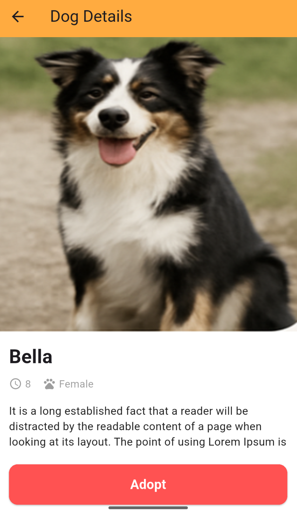
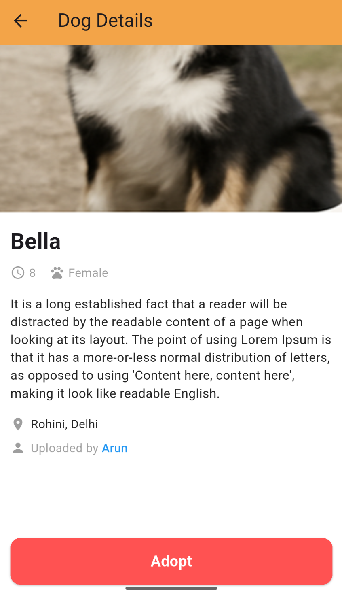
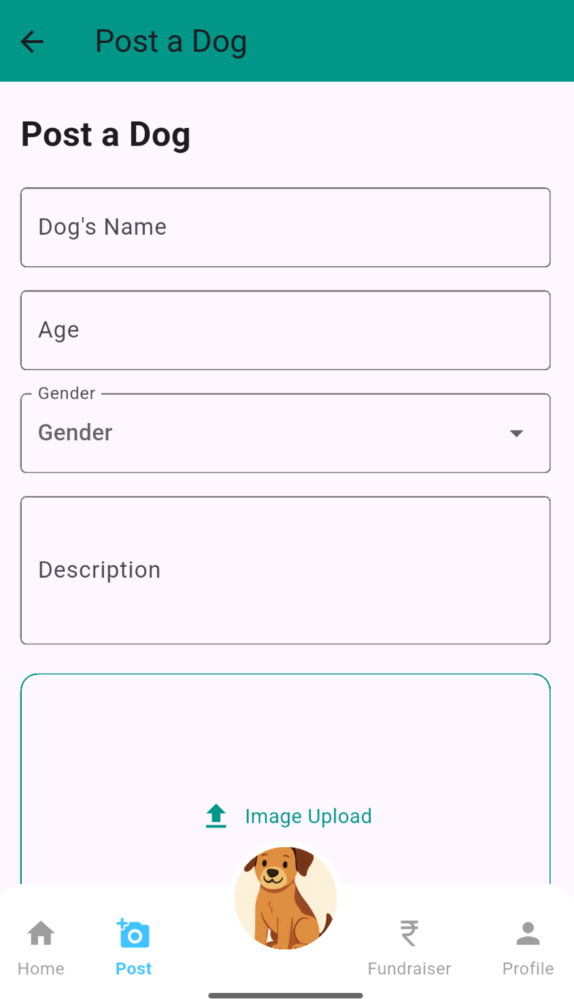
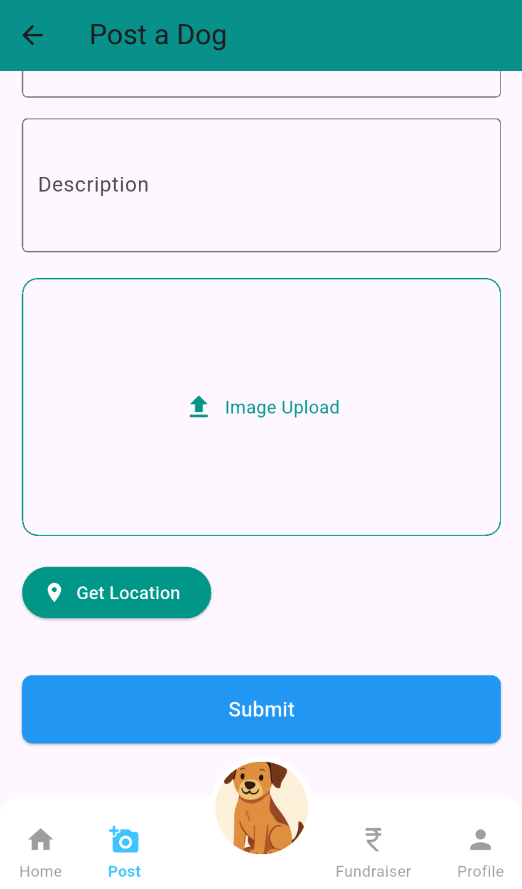
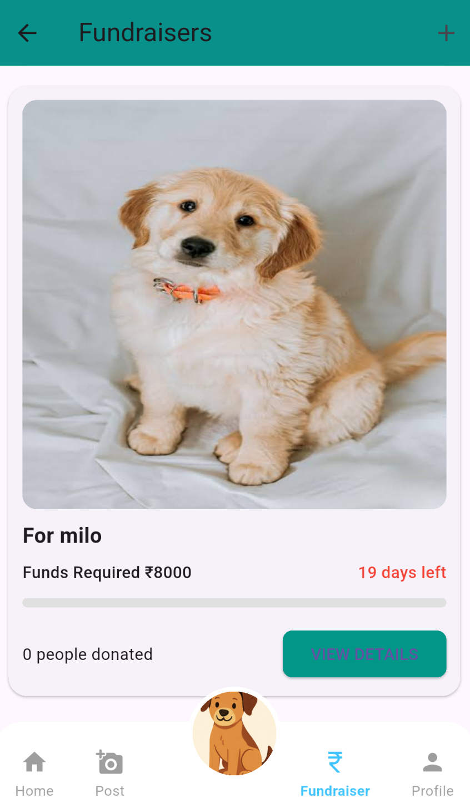
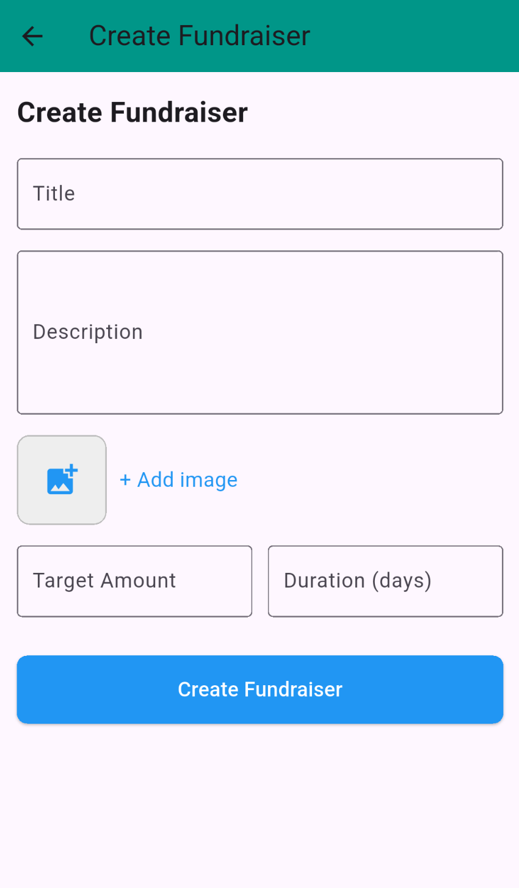
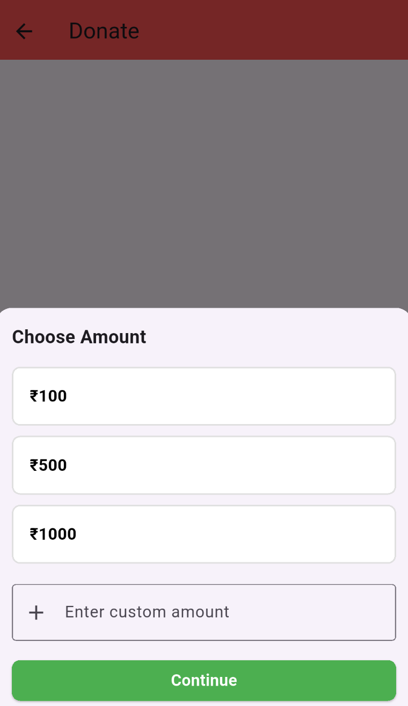
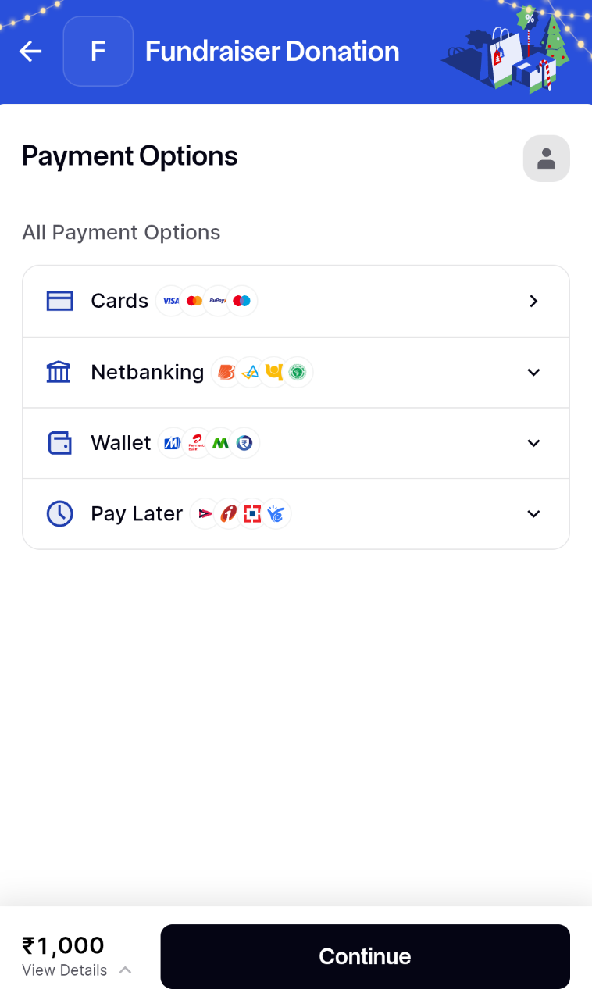

# Pawpal 🐾

**Pawpal** is a mobile app designed to improve the lives of street dogs by connecting people who want to help, adopt, or donate for their welfare. The app allows users to upload street dogs, adopt them, and create fundraisers for their care.  

---

## Problem Statement
Delhi’s stray dog situation is a growing concern. Supreme Court directives focus on removing stray dogs from public spaces such as schools and hospitals and sheltering them after sterilization and vaccination. **Pawpal** addresses this problem by making adoption and donations easier and helping the stray dog population get proper care.

---

## Features

### 1. Authentication (Login & Signup)
Users can securely create an account and log in to access all features of the app.

  
  

---

### 2. Home Page & Nearby Street Dogs
View nearby street dogs based on the user’s current location.

  

---

### 3. Dog Details & Adoption
View detailed information about a dog and send an adoption request directly through the app.

  
  

---

### 4. Upload Street Dogs
Add information about stray dogs spotted in your area to help others adopt or support them.

  
  

---

### 5. Fundraiser Listings & Details
Browse active fundraisers and view detailed information about each campaign.

  
  
  

---

### 6. Create Fundraisers
Create fundraisers to collect donations for medical care, food, and shelter for street dogs.

  

---

### 7. Donations (Razorpay Integration)
Make secure donations using Razorpay to support fundraisers.

  
  

---

### 8. User Profile
View and manage user profile information and activity.

  
  

---

## Tech Stack
- **Frontend:** Flutter  
- **Backend:** Node.js, Express  
- **Database:** MongoDB

  
